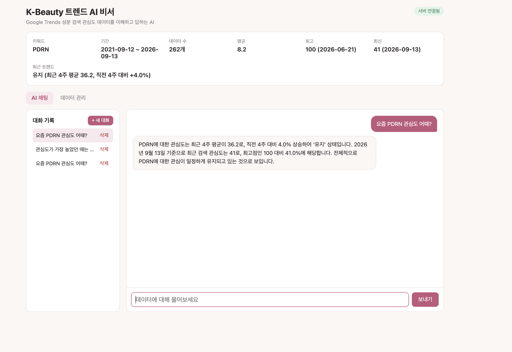
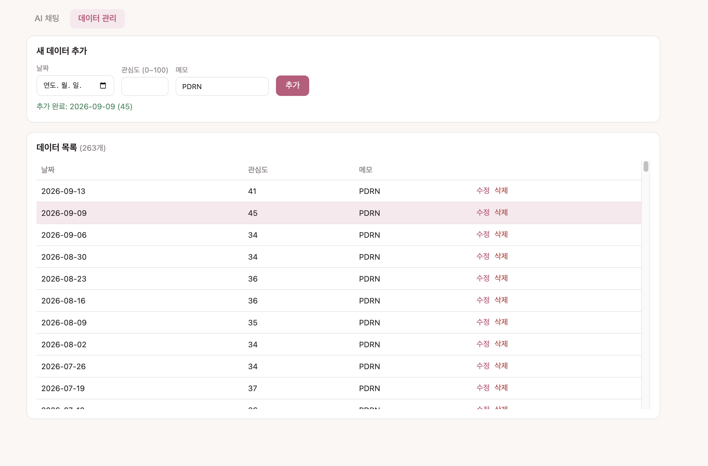
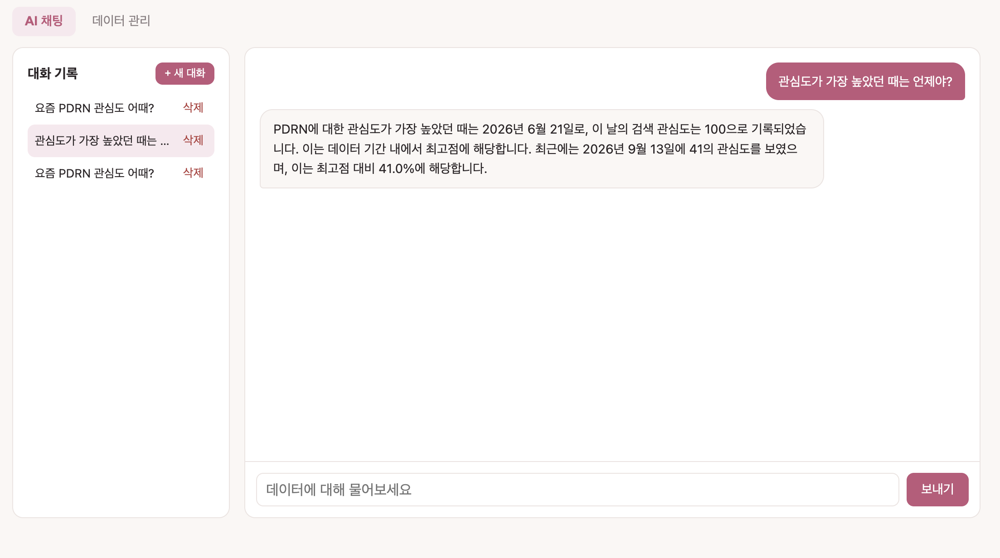

# K-Beauty 트렌드 AI 비서

> 내 데이터를 이해하고 답하는 AI 비서 — Google Trends K-뷰티 성분(PDRN) 검색 관심도 데이터 기반

일반 ChatGPT는 "요즘 PDRN 관심도 어때?"라고 물으면 일반론만 답합니다.
이 서비스는 **실제 5년치 주간 검색 관심도 데이터(262개)** 를 분석해 요약하고, 그 요약을 시스템 프롬프트에 주입해 **데이터에 근거한 맞춤 답변**을 제공합니다.

## 배포 URL

| 구분 | URL |
|---|---|
| 프론트엔드 (Vercel) | https://kbeauty-ai-assistant.vercel.app |
| 백엔드 API (Render) | https://kbeauty-ai-assistant.onrender.com |
| Swagger UI | https://kbeauty-ai-assistant.onrender.com/docs |

> Render 무료 티어는 15분 동안 요청이 없으면 잠듭니다. 첫 접속 시 최대 1분 정도 걸릴 수 있으며, 프론트는 접속 즉시 `/`를 호출해 서버를 깨우고 3초 이상 걸리면 안내 배너를 표시합니다.

## 기술 스택

| 영역 | 기술 |
|---|---|
| 백엔드 | Python 3.12, FastAPI, Uvicorn, Pydantic |
| DB | Firebase Firestore (firebase-admin) |
| AI | OpenAI GPT API (`gpt-4o-mini`) |
| 프론트엔드 | HTML / CSS / JavaScript (바닐라) |
| 배포 | Render (백엔드), Vercel (프론트엔드) |

## 데이터

- 출처: Google Trends 주간 검색 관심도 (0~100, 기간 내 최고점 = 100)
- 키워드: **PDRN** (연어 DNA 유래 스킨케어 성분)
- 기간: 2021-09-12 ~ 2026-09-13, **262개 데이터 포인트**
- 형식: `(date, value, memo)` → `("2026-09-13", 41, "PDRN")`

## 프로젝트 구조

```
kbeauty-ai-assistant/
├── backend/
│   ├── main.py               # FastAPI 앱, CORS, 라우터 등록
│   ├── schemas.py            # Pydantic 요청/응답 모델 (입력 검증)
│   ├── seed.py               # CSV → Firestore 초기 업로드
│   ├── routers/
│   │   ├── data.py           # 데이터 CRUD + 요약
│   │   ├── conversations.py  # 대화 기록 저장/조회/삭제
│   │   └── chat.py           # AI 채팅 (컨텍스트 주입)
│   ├── services/
│   │   ├── firebase.py       # Firestore 연결 (환경 변수로 키 로드)
│   │   └── summary.py        # 시계열 요약 계산
│   └── data/merged_processed.csv
└── frontend/
    ├── index.html, style.css, app.js
    ├── config.js             # API 주소 (배포 시 빌드 단계에서 생성)
    └── vercel.json
```

**분리 기준**: `routers`는 HTTP 요청/응답만 담당하고, 비즈니스 로직(요약 계산)과 외부 연결(Firestore)은 `services`로 분리했습니다. 요약 로직은 DB와 무관한 순수 함수라 따로 테스트할 수 있습니다.

## API 명세

### 데이터 (`data` 컬렉션)
| Method | Endpoint | 설명 |
|---|---|---|
| POST | `/api/data` | 새 데이터 추가 |
| GET | `/api/data` | 데이터 목록 조회 (날짜순) |
| PUT | `/api/data/{id}` | 데이터 수정 |
| DELETE | `/api/data/{id}` | 데이터 삭제 |
| GET | `/api/data/summary` | 데이터 요약 (프롬프트 주입용) |

### 대화 기록 (`conversations` 컬렉션)
| Method | Endpoint | 설명 |
|---|---|---|
| POST | `/api/conversations` | 대화 저장 |
| GET | `/api/conversations` | 대화 목록 (**messages 미포함**, 제목·메시지 수만) |
| GET | `/api/conversations/{id}` | 특정 대화의 전체 messages 조회 (불러오기) |
| DELETE | `/api/conversations/{id}` | 대화 삭제 |

> 불러오기는 **(A) 방식**: 목록은 가볍게 유지하고, 선택한 대화만 전체 messages를 조회합니다.

### AI 채팅
| Method | Endpoint | 설명 |
|---|---|---|
| POST | `/api/chat` | `{ "message": "...", "conversation_id": "선택" }` → `{ "reply", "conversation_id" }` |

## 컨텍스트 주입 흐름

```
사용자 질문
   │
   ▼
POST /api/chat
   ├─ 1. 데이터 요약 조회 (build_summary)
   ├─ 2. 요약을 시스템 프롬프트에 삽입
   ├─ 3. (이어서 대화 시) 이전 메시지 최근 10개 추가
   ├─ 4. GPT API 호출 (max_tokens 400)
   └─ 5. 질문 + 답변을 conversations에 자동 저장
   │
   ▼
{ reply, conversation_id }
```

### 요약 응답 예시 (`GET /api/data/summary`)
```json
{
  "keyword": "PDRN",
  "period": "2021-09-12 ~ 2026-09-13",
  "count": 262,
  "metrics": {
    "average": 8.2,
    "max": 100, "max_date": "2026-06-21",
    "min": 0, "min_date": "2021-09-12",
    "latest": 41, "latest_date": "2026-09-13",
    "peak_ratio_pct": 41.0
  },
  "trend": "유지 (최근 4주 평균 36.2, 직전 4주 대비 +4.0%)",
  "recent": [{ "date": "2026-07-26", "value": 34 }, "... 최근 8주"]
}
```

- **트렌드 판정**: 최근 4주 평균과 직전 4주 평균을 비교해 +5% 이상이면 상승, -5% 이하면 하락, 그 사이면 유지
- **recent**: "최근 몇 주 어땠어?" 같은 질문에 답할 수 있도록 최근 8주 값을 함께 주입

## 입력 검증 (Pydantic)

- `date`: `YYYY-MM-DD` 날짜 형식만 허용
- `value`: 정수 0~100 (Google Trends 지수 범위)
- `memo`: 최대 100자
- `message`: 1~1000자
- 잘못된 입력은 FastAPI가 자동으로 **422**를 반환하고, 없는 id는 **404**, AI 호출 실패는 **502**로 처리

## 로컬 실행 방법

```bash
# 1. 백엔드
cd backend
python3 -m venv venv
source venv/bin/activate
pip install -r requirements.txt
cp .env.example .env           # 값 채우기
# Firebase 서비스 계정 키를 backend/serviceAccountKey.json 으로 저장

python seed.py                 # CSV → Firestore 업로드 (최초 1회)
uvicorn main:app --reload      # http://127.0.0.1:8000/docs

# 2. 프론트엔드 (새 터미널)
cd frontend
python3 -m http.server 5500    # http://127.0.0.1:5500
```

## 환경 변수

### 백엔드 (Render)
| 이름 | 설명 |
|---|---|
| `OPENAI_API_KEY` | OpenAI API 키 |
| `OPENAI_MODEL` | 사용할 모델 (기본 `gpt-4o-mini`) |
| `FIREBASE_SERVICE_ACCOUNT_JSON` | 서비스 계정 키 JSON 전체 (배포용) |
| `FIREBASE_SERVICE_ACCOUNT_PATH` | 서비스 계정 키 파일 경로 (로컬용) |
| `ALLOWED_ORIGINS` | CORS 허용 도메인, 쉼표 구분 |

### 프론트엔드 (Vercel)
| 이름 | 설명 |
|---|---|
| `API_BASE_URL` | 백엔드 주소. 빌드 시 `config.js`로 생성됨 |

## 보안 및 운영

- API 키와 서비스 계정 키는 **환경 변수로만 관리**하고, `.env`와 키 파일은 `.gitignore`로 커밋에서 제외
- **CORS**는 `ALLOWED_ORIGINS`에 등록된 프론트 도메인만 허용
- **비용 제한**: `max_tokens=400`, 이전 대화는 최근 10개 메시지만 전달
- Firestore 보안 규칙은 프로덕션 모드(클라이언트 직접 접근 차단)이며, 서버는 Admin SDK로만 접근

## 제출 스크린샷

### 1. 데이터 요약이 보이는 채팅 화면


### 2. 데이터 관리 화면 (추가/수정 동작)


### 3. 대화 기록 불러오기

